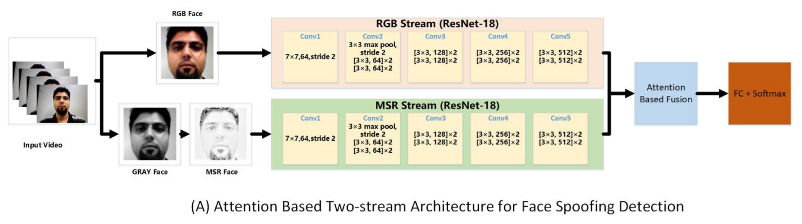
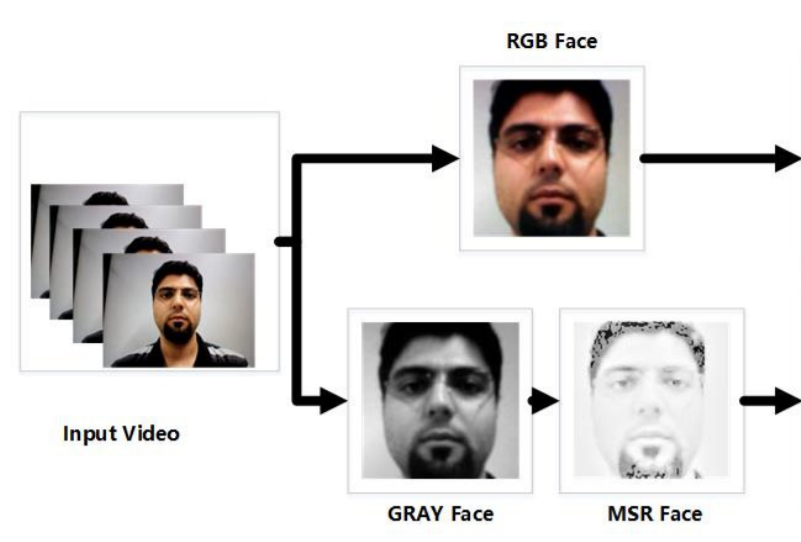
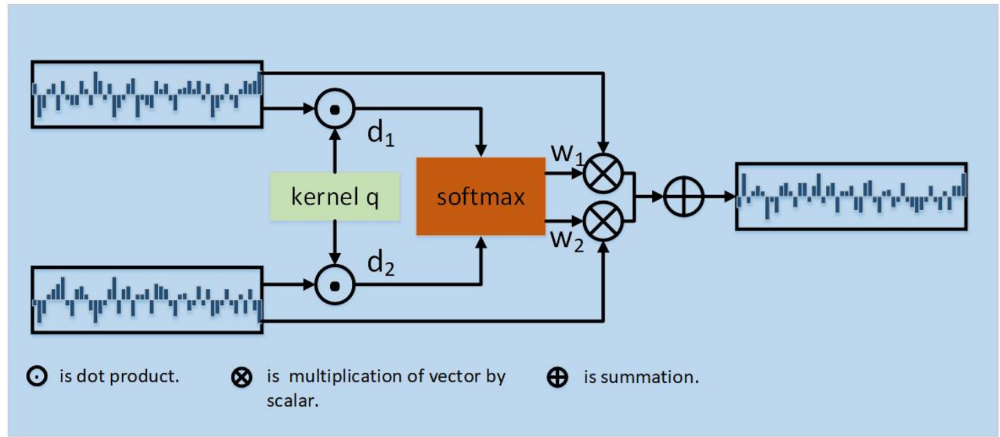

## Attention-Based Two-Stream Convolutional Networks for Face Spoofing Detection

This repo implements the idea from this paper: [https://pureadmin.qub.ac.uk/ws/portalfiles/portal/174233508/Attention_Based_Two_Stream_Convolutional_Networks_for_Face_Spoofing_Detection.pdf](https://pureadmin.qub.ac.uk/ws/portalfiles/portal/174233508/Attention_Based_Two_Stream_Convolutional_Networks_for_Face_Spoofing_Detection.pdf). The core motive behind this paper was to create a model which would be insensitive to illumination in detecting spoofing attacks.

This repo will be explained in 5 sections: 

1. Data
 2. CNN Backbone
 3. Retinex Function
 4. Train
 5. Inference

## 1. Data
Training and testing images are stored in test and train folders respectively. The folder will be organised as such:
videos

    train
	    └── real
	    	    └── real1.jpg
	    	    .
	    	    .
	    └── fake
	    	    └── fake1.jpg
	    	    .
	    	    .
    test
	    └── real
	    └── fake

## 2. CNN Backbone

As shown in the image below, a CNN is needed in the MSR and RGB stream. I have decided to proceed with MobileNetV3 taken from [https://github.com/xiaochus/MobileNetV3](https://github.com/xiaochus/MobileNetV3) due to its lightweight architecture.

This backbone can be substituted with any of the backbones here: [https://keras.io/api/applications/](https://keras.io/api/applications/).

## 3. Retinex Function

The Multi-Scale Retinex (MSR) functions have been taken from: [https://github.com/dongb5/Retinex](https://github.com/dongb5/Retinex). The core idea behind the use of MSR is written in the paper: 

> MSR can separate an image to illumination component and reflectance
> component, and the illuminationremoved reflectance component is used
> for liveness detection

## 4. Train

To carry out training, a custom DataGenerator is needed as well as the Attention layer used in the paper. 

The custom DataGenerator is found in `datagen.py` and it generates batches of images in the format **[BxHxWxC RGB image, BxHxWxC MSR image]** as shown in the image below.

The Attention-based Fusion stated in the paper can be found in `attention.py`. The inner working of the layer can be seen in the image below.

## 5. Test
To test the model using your webcam, run the following command: `python test.py`
